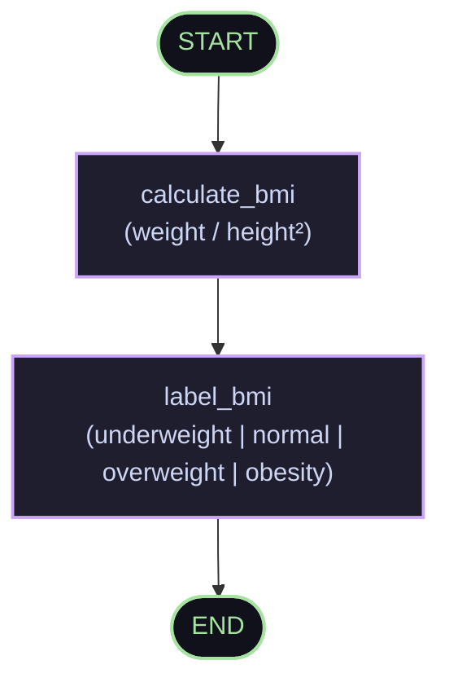

<div align="center">

# 🕸️ LangGraph Labs
### *Hands-on Experiments, Blueprints & Stateful Agentic Workflows*

[](https://www.python.org/)
[](https://langchain-ai.github.io/langgraph/)
[](https://www.langchain.com/)
[](https://groq.com/)
[](https://openai.com/)
[](https://jupyter.org/)

<p align="center">
  <b>A curated sandbox exploring graph-based agent orchestration, typed state management, and multi-step cognitive pipelines with LangGraph.</b>
</p>

[Explore Labs](#-lab-catalogue) • [Quickstart](#-quickstart) • [Architecture](#-graph-paradigms) • [Roadmap](#-roadmap)

---

</div>

## 🌌 Overview

Traditional linear chains struggle when applications require **cycles, persistent memory, branching logic, and state accumulation**. 

**LangGraph Labs** serves as a structured, step-by-step experimentation playground where you transition from basic single-node graph executions to stateful chatbots and complex sequential reasoning pipelines.

```
       ┌────────┐
       │ START  │
       └───┬────┘
           │
           ▼
    ┌──────────────┐
    │  State Node  │◄────────────┐
    │  (Transform) │             │ (Cyclic / Branching)
    └──────┬───────┘             │
           │                     │
           ├───[Condition Met?]──┘
           │
           ▼
        ┌─────┐
        │ END │
        └─────┘
```

---

## 🧭 Repository Blueprint

```tree
LangGraph-labs/
├── 🤖 basic_chatbot.ipynb               # Conversational agent powered by Groq & message reducers
├── 📂 sequential-workflows/             # Directed step-by-step graph pipelines
│   ├── 🌿 greeting_workflow.ipynb       # Hello-World graph introduction
│   ├── ➕ basic_sequitional-example.ipynb # Arithmetic transformation graph (Addition)
│   ├── ➖ subtraction_workflows.ipynb   # State-driven math pipeline (Subtraction)
│   └── ⚖️ bmi-calculator.ipynb          # Multi-stage sequential pipeline (Compute -> Categorize)
├── 📄 requirements.txt                  # Python dependencies
├── 🔐 .env.example                      # Template for API keys
└── 📖 README.md                         # Documentation & Guide
```

---

## 🔬 Lab Catalogue

### 1. 🤖 Dynamic Conversational Loop (`basic_chatbot.ipynb`)
Build a stateful chatbot using **Groq** (`llama-3.3-70b-versatile`) and LangGraph's `StateGraph`.
- **Key Mechanics**: `TypedDict` state schema, `Annotated[list[BaseMessage], add_messages]` reducer for non-destructive history appending.
- **Flow**:
  ```mermaid
  graph LR
      START([START]) --> chat_node["chat_node\n(LLM Invoke)"]
      chat_node --> END([END])
      
      classDef node fill:#1e293b,stroke:#38bdf8,stroke-width:2px,color:#fff;
      classDef edge fill:#0f172a,stroke:#a855f7,stroke-width:2px,color:#fff;
      class chat_node node;
      class START,END edge;
  ```

---

### 2. ⛓️ Sequential Pipelines (`sequential-workflows/`)

| Notebook | Graph Flow | Description | Concepts Mastered |
| :--- | :--- | :--- | :--- |
| **`greeting_workflow.ipynb`** | `START ➔ create_greeting ➔ END` | Minimal state transformation graph. | `StateGraph`, `START`, `END`, Graph Compilation |
| **`basic_sequitional-example.ipynb`** | `START ➔ addition ➔ END` | Numerical state injection and arithmetic execution. | `TypedDict` state schema, Node return updates |
| **`subtraction_workflows.ipynb`** | `START ➔ subtraction ➔ END` | Multi-variable calculation pipeline with custom inputs. | Input state passing, state payload mutation |
| **`bmi-calculator.ipynb`** | `START ➔ calculate_bmi ➔ label_bmi ➔ END` | Two-stage pipeline: compute numeric BMI, then infer health category. | Multi-node chaining, progressive state enrichment |

#### ⚖️ BMI Sequential Workflow Flowchart:


---

## ⚡ Core Concepts Explained

### 📦 1. The State Object (`TypedDict`)
The **State** is the single source of truth passed between all nodes. Each node receives the current state and returns an updated dictionary slice:
```python
from typing import TypedDict, Annotated
from langgraph.graph.message import add_messages
from langchain_core.messages import BaseMessage

class ChatState(TypedDict):
    # 'add_messages' ensures new messages append instead of overwriting history
    messages: Annotated[list[BaseMessage], add_messages]
```

### 🧩 2. Graph Construction & Compilation
```python
from langgraph.graph import StateGraph, START, END

# Initialize graph with state schema
graph = StateGraph(ChatState)

# Register nodes
graph.add_node("chat_node", chat_node)

# Declare execution flow
graph.add_edge(START, "chat_node")
graph.add_edge("chat_node", END)

# Compile into an executable runnable
app = graph.compile()
```

---

## 🚀 Quickstart

### 1. Clone & Set Up Virtual Environment

```bash
# Clone the repository
git clone https://github.com/victorjanni/LangGraph-labs.git
cd LangGraph-labs

# Create and activate virtual environment
python -m venv myenv

# Windows
myenv\Scripts\activate

# Linux / macOS
source myenv/bin/activate
```

### 2. Install Dependencies

```bash
pip install -r requirements.txt
```

### 3. Configure Environment Variables

Create a `.env` file in the root directory:

```env
GROQ_API_KEY=your_groq_api_key_here
OPENAI_API_KEY=your_openai_api_key_here
```

### 4. Launch Jupyter Lab / Notebook

```bash
jupyter notebook
```
Open any notebook in `sequential-workflows/` or test the `basic_chatbot.ipynb` to see the graph come alive!

---

## 🗺️ Roadmap & Upcoming Labs

- [x] Basic Single-Node Graphs & Workflows
- [x] Multi-Node Sequential Pipelines (BMI Calculator)
- [x] Conversational StateGraph with Groq LLM
- [ ] 🔀 **Conditional Routing & Branching** (Dynamic Decision Nodes)
- [ ] 🛠️ **Tool-Calling ReAct Agents** (Search, Calculator, Custom Python Tools)
- [ ] 💾 **State Persistence & Memory Checkpointers** (`MemorySaver`, SQLite checkpointers)
- [ ] 🧑‍💻 **Human-in-the-Loop (HITL)** (Breakpoints & Approval Flows)
- [ ] 🤝 **Multi-Agent Collaboration** (Supervisor / Worker Graph Patterns)

---

## 🛠️ Tech Stack

- **Framework**: [LangGraph](https://github.com/langchain-ai/langgraph) / [LangChain](https://github.com/langchain-ai/langchain)
- **Inference**: [Groq Cloud](https://console.groq.com) (`llama-3.3-70b-versatile`) / [OpenAI](https://platform.openai.com/)
- **Language**: Python 3.10+
- **Environment**: Jupyter Notebooks / dotenv

---

## 📄 License

This repository is licensed under the [MIT License](LICENSE). Feel free to fork, experiment, and build your own graph-based autonomous systems!

<div align="center">
  <sub>Built with ❤️ for graph-powered AI engineering. Star ⭐ this repo if you find it helpful!</sub>
</div>
